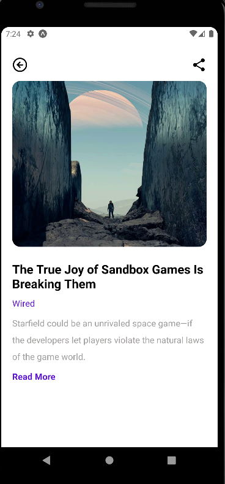
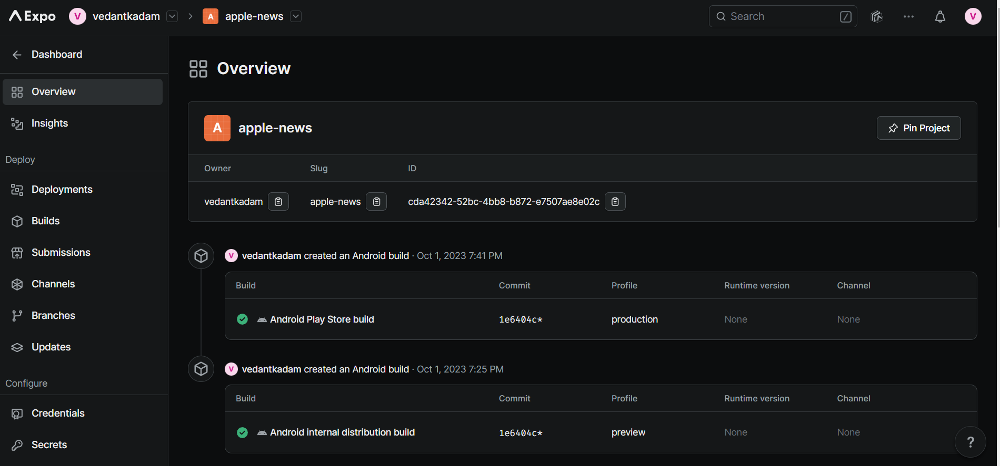
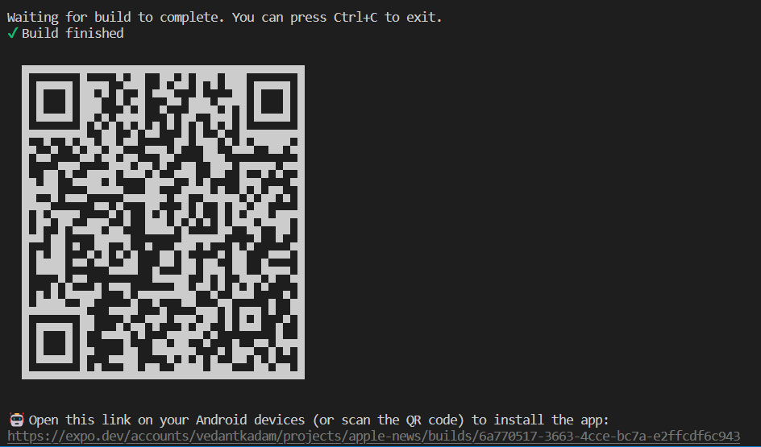

# News App

Welcome to the News App, a React Native application that allows you to stay updated with real-time news from around the world. This app uses Expo CLI, React Native, Axios, and the News API to provide you with the latest news. You can explore news from various categories and easily share the news articles with others. The app has been deployed on the Expo platform, making it accessible through Android internal distribution and the Android Play Store.

## Tech Stack

- **Expo CLI**: Expo CLI was used to kickstart and manage the React Native project, providing a seamless development experience.
- **React Native**: The core framework for building the cross-platform mobile app.
- **Axios**: Axios is used for making HTTP requests to fetch news data from the News API.
- **News API**: An open-source API that provides real-time news from various sources and categories.
- **React Navigation**: Used for creating navigation within the app, making it easy to switch between different screens.

## Features

- **Real-time News**: Stay updated with the latest news from around the world. The app fetches data from the News API in real-time.
- **Category-Based News**: Explore news articles based on different categories such as sports, technology, entertainment, and more.
- **Share News**: Share interesting news articles with friends and family through various sharing options.
- **Cross-Platform**: The app is built with React Native, making it available on both Android and iOS platforms.
- **Expo Deployment**: The app has been deployed on the Expo platform, allowing for easy distribution and updates.

## UI Screenshots





## Getting Started

To get started with the News App on your local development environment, follow these steps:

1. Clone the repository:

   ```bash
   git clone <repository-url>
   ```

2. Install dependencies:

   ```bash
   npm install
   ```

3. Start the development server:

   ```bash
   npm start or npm expo start
   ```

4. Use Expo to run the app on an emulator or physical device.

## Deployment

The News App has been deployed on the Expo platform. It is available for Android internal distribution.

- [News App on Expo](https://expo.dev/accounts/vedantkadam/projects/apple-news/builds/6a770517-3663-4cce-bc7a-e2ffcdf6c943)


## Screenshots




